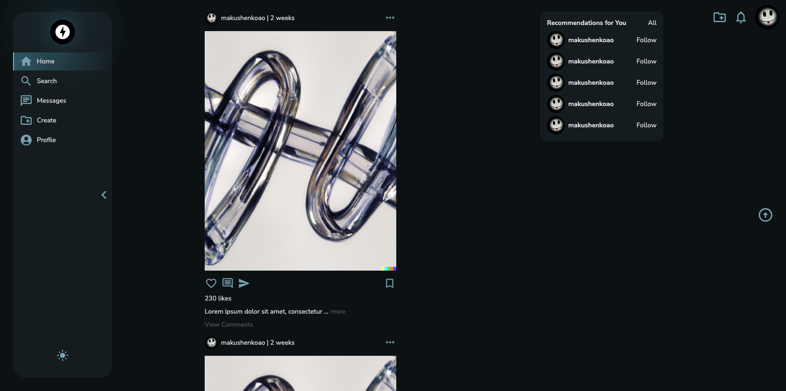

# AK Messenger - _all you need in one place_


Our messenger is an innovative platform that combines the functionality of a social network and a messenger. Users can publish their posts, exchange messages, follow the activity of other users, comment and like their posts, and receive real-time notifications about important events and interactions. Our product provides convenience and freedom of communication, as well as a wide range of additional functions for a rich user experience.



---

## Key Features

-   **Feature:** Description

---

## Start project

```
npm run install - install dependencies
npm run start - launch project in developer mode
```

---

## Scripts

-   `npm run start` or `npm run dev` - Start the frontend project on the webpack dev server
-   `npm run build:prod` - Build in prod mode
-   `npm run build:dev` - Build in dev mode
-   `npm run lint:ts` - Check ts files with linter
-   `npm run lint:ts:fix` - Fix ts files with linter
-   `npm run lint:scss` - Check scss style files with linter
-   `npm run lint:scss:fix` - Fix scss style files with linter
-   `npm run generate:slice` - Script to generate FSD slices
-   `npm run generate:route` - Script to generate route
-   `npm run postinstall` - Clear project cache
-   `npm run prettier` - Code formatting

---

## Project Architecture

The project was written in accordance with the [Feature sliced design methodology](https://feature-sliced.design/docs/get-started/tutorial)

---

## Linting

The project uses eslint to check typescript code and stylelint to check files with styles.

Also for strict control of the main architectural principles own eslint plugin [eslint-plugin-makushenkoao-plugin](https://www.npmjs.com/package/eslint-plugin-makushenkoao-plugin) is used, which contains 3 rules

1. path-checker - prohibits the use of absolute imports within one module
2. layer-imports - checks the correct use of layers in terms of FSD (e.g. widgets cannot be used in features and entities)
3. public-api-imports - allows import from other modules only from public api. Has auto fix

##### Run linters

-   `npm run lint:ts` - Check ts files with linter
-   `npm run lint:ts:fix` - Fix ts files with linter
-   `npm run lint:scss` - Check scss style files with linter
-   `npm run lint:scss:fix` - Fix scss style files with linter

---

## Project configuration

For development, the project contains 1 config:

1. Webpack - ./config/build

Both collectors are adapted to the main features of the application.

All configuration is stored in /config

-   /config/build - webpack configuration

The `scripts` folder contains various scripts for refactoring\simplification of writing code\report generation, etc.

---

## CI pipeline

The GitHub action config is in /.github/workflows.
All types of tests, assembly of the project and storybook, linting are carried out in it.

---

## Working with data

Interaction with data was carried out using the Redux toolkit.
Whenever possible, reusable entities should be normalized using the EntityAdapter

Server requests are sent using [RTK query](/src/shared/api/rtkApi.ts)

For asynchronous connection of reducers (so as not to pull them into a common bundle), use
[DynamicModuleLoader](/src/shared/lib/components/DynamicModuleLoader/DynamicModuleLoader.tsx)

---

## Entities

-   [Entity](/src/entities)

## Features

-   [Feature](/src/features)

---

## Contact Us

If you have any questions, suggestions, or inquiries, please don't hesitate to contact our team at [antonmak2046@gmail.com](mailto:antonmak2046@gmail.com). We value your feedback and are excited to hear from you!
